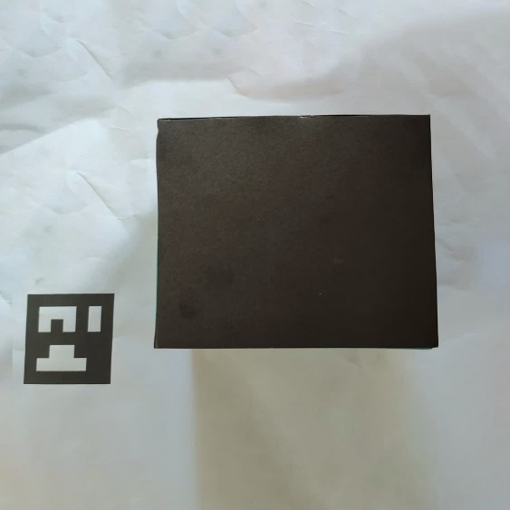
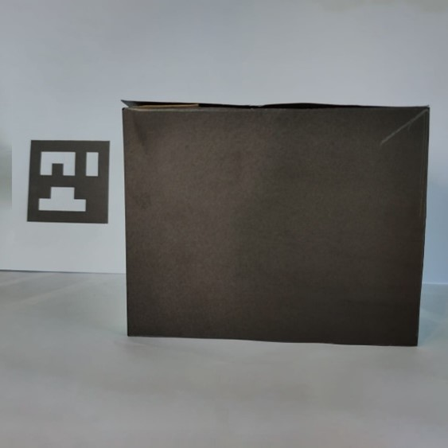
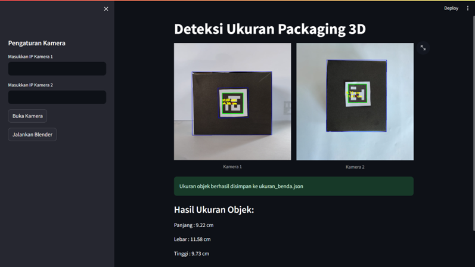
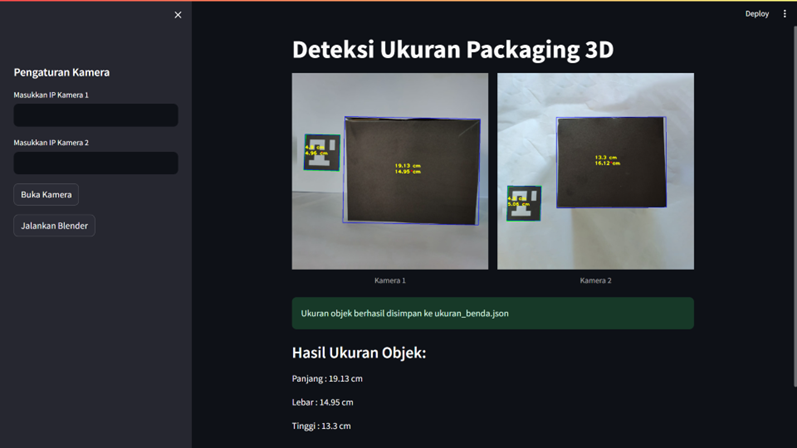
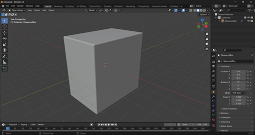
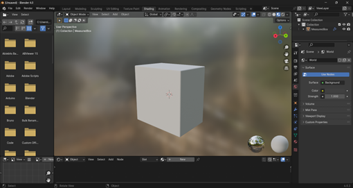

# Aruco Measure Object Size Computer Vision
*   [Repository Master [denisikiandani/ComputerVision-3d_Object_Detector]](https://github.com/denisikiandani/ComputerVision-3d_Object_Detector.git): Ini adalah Repository Kelompok Dari Matakuliah Visi Komputer.

---
 
Proyek ini mendemonstrasikan cara mengukur ukuran objek 3D menggunakan marker ArUco dan teknik visi komputer.  Menggunakan kamera, proyek ini mendeteksi marker ArUco, menghitung pose (posisi dan orientasi) marker, dan kemudian memanfaatkan informasi tersebut untuk memperkirakan dimensi objek yang ditempatkan di dekat atau di atas marker.

## Refrensi

https://github.com/user-attachments/assets/44b9caff-ecde-4d76-b0c1-96e0773c5530   


## Deskripsi
Proyek ini menyediakan implementasi langkah demi langkah untuk mengukur ukuran objek 3D dengan menggunakan marker ArUco dan visi komputer. Cara kerja:
| Gambaran        | Gambaran        |
| ------------- | ------------- |
|   |    |
*   **Deteksi Marker ArUco:** Mendeteksi marker ArUco dalam frame kamera.
*   **Estimasi Pose:** Menghitung posisi dan orientasi marker ArUco relatif terhadap kamera.
*   **Perhitungan Ukuran Objek:** Memperkirakan dimensi objek berdasarkan pose marker dan pengetahuan tentang ukuran marker.
*   **Visualisasi:** Menampilkan hasil pengukuran pada frame kamera.

---

## Libary 
*   **opencv-python:** Library OpenCV untuk Python.
*   **numpy:** Library NumPy untuk komputasi numerik.
*   **streamlit:** Library Streamlit untuk membuat aplikasi web interaktif.
*   **bpy:** Library Python untuk Blender. Ini diasumsikan sebagai instalasi Blender yang sesuai dan konfigurasi variabel lingkungan yang benar untuk Python agar dapat mengakses Blender.


## How To Use
1. clone 
   ```bash
    git clone https://github.com/Dhiandika/aruco_measure_object_size_computer_vision.git
    cd aruco_measure_object_size_computer_vision
    ```
2. install depedensi
   ```bash
    pip install -r requirements.txt
    ```
3. install ip camera, need (1/2 ip)
4. run the program
   ```bash
    python main.py
    ```


---

## Hasil
 https://github.com/user-attachments/assets/183035b7-9761-442a-86d4-cef299dcef31 

 

### Blender
  
  

